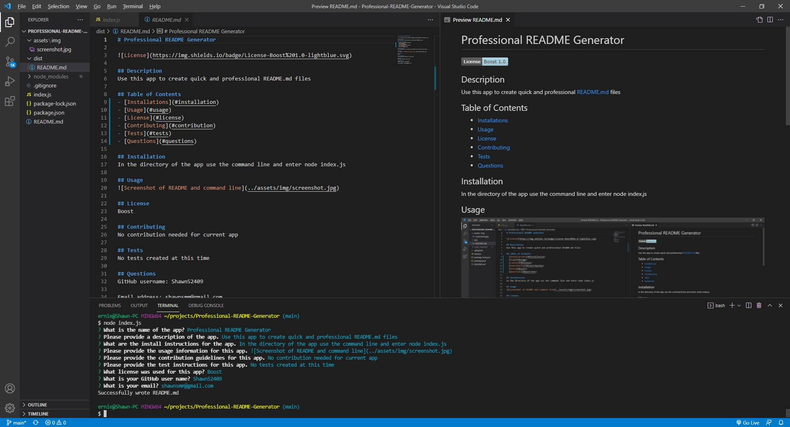

# Professional README Generator
Created by Shawn Miller

# Technologies Used
- Node.js
- npm Inquirer
- JavaScript

# Description
This app is used to create Professional README.md file that can be used after a user has created a professional app. To use this app a user must first run install node.js and run a npm install. The user can then run node index.js at the command terminal. The terminal will prompt you with all the questions needed to create a README.md file and the file will be saved to the 'dist' folder after all the questions are answered.

Please note: This is not the README file that was created by the app. The README.md file created by the app is in the dist folder.

# Appearance

# Known Bugs
No known bugs.

## Contact info
shawnsmm@gmail.com