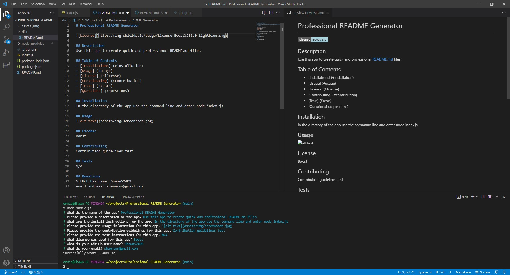

# Professional README Generator

## Description
Use this app to create quick and professional README.md files

## Table of Contents
- [Installations] (#installation)
- [Usage] (#usage)
- [License] (#license)
- [Contributing] (#contribution)
- [Tests] (#tests)
- [Questions] (#questions)

## Installation
In the directory of the app use the command line and enter node index.js

## Usage

## License
Boost

## Contributing
No contribution needed for current app

## Tests
No tests created at this time

## Questions
GitHub username: Shawn52409

Email address: shawnsmm@gmail.com
